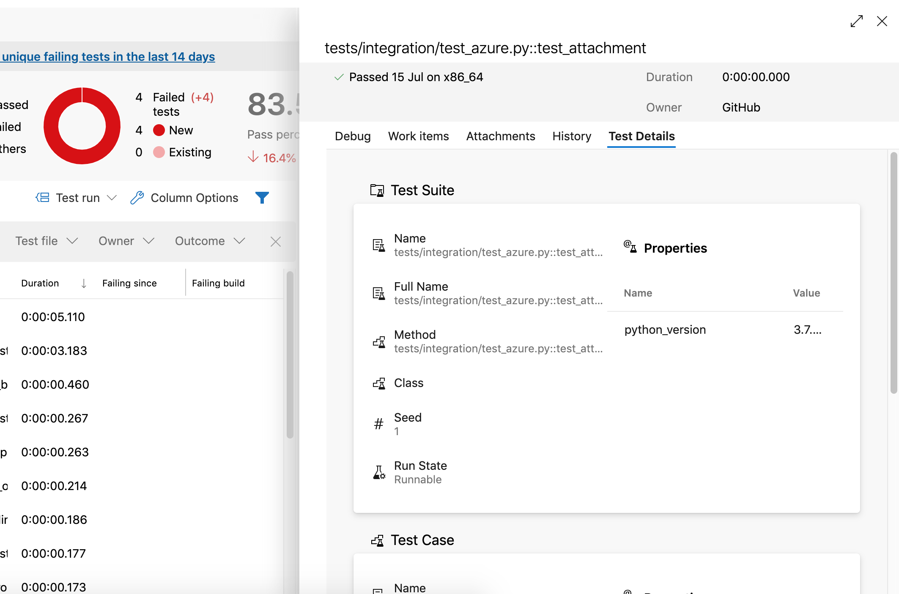

# vs-nunit

[](https://dev.azure.com/AnthonyShaw/vs-nunit/_build/latest?definitionId=6&branchName=master)

An NUnit UI extension for test cases in Azure DevOps (VSO)

Loads NUnit XML 2/3 test results and displays additional detail in the test console



## Compatibility

NUnit 3.0 XML output provides more granular data. The amount of data shown will depend on the plugin output.

| Platform/Plugin      | NUnit Output           | Supported?  |
| -------------------- |:-----------------:| -----:|
| Pytest/[pytest-nunit](https://pypi.org/project/pytest-nunit/)  | 3.0 XML | **Yes** |
| Node/[jest-nunit-reporter](https://www.npmjs.com/package/jest-nunit-reporter) | 2.0 XML      |   Yes  (minimal data) |
| .NET/NUnit 2                        | 2.5 XML      |   **Yes** (minimal data) |
| .NET/NUnit 3                        | 3.0 XML      |   **Yes**  |

### Install

The project can be installed using npm

```
npm install
```

### Build

To build the components:

```
npm run build
```

The package will be within the `dist/` directory as a VSIX extension file.

### Testing

The test suite is written in TypeScript and kept within the source dir. To run jest, call:

```
npm run test
```
